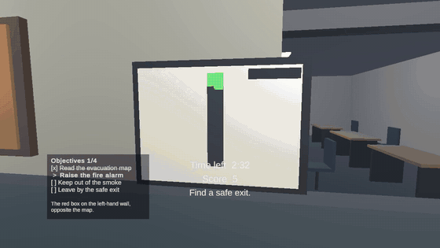

# VR Emergency Response Training Simulator

Virtual-reality emergency drills built in Unity. Each scenario puts the user in
a building, starts an emergency, and asks them to make the decisions that keep
them alive. Every run is timed, scored and reported back with guidance on what
to do differently next time.

Two scenarios are playable:

| Scenario | The decision being trained |
|---|---|
| **Fire evacuation** | Raise the alarm, read the map, stay out of smoke, take the safe exit rather than the nearest one |
| **Earthquake** | Take cover and *stay* under it, keep clear of glazing and tall furniture, use the stairs rather than the lift |

**Status: in development.** Both scenarios are complete and playable on the
desktop simulator. Neither has been run on a headset.

## Demo



Raising the alarm, walking into the smoke, and taking the safe exit. The full
**[56-second demo video](Docs/demo.mp4)** runs the drill from briefing to results.

The recording is the real scenario, not a scripted flythrough: the start button is
pressed, the map and alarm are used, the smoke is entered and left, and the exit is
taken. The objectives, timer and score on screen are the ones the running scenario
produced.

## Motivation

Emergency training is usually passive, hard to repeat and expensive to stage.
A VR drill can be repeated as often as someone likes, at no risk, and can record
what the person actually did rather than whether they attended.

Possible applications: campus emergency preparedness, workplace safety
onboarding, laboratory and hospital training, and accessibility-aware
evacuation planning.

## Screenshots

| | |
|---|---|
|  |  |
| The briefing explains the objectives and the controls | Smoke closes the southern route |
|  |  |
| Results with tailored guidance | The earthquake classroom, glazed along one wall |

## Features

- Two scenarios: a fire evacuation and an earthquake drill
- Room-scale VR rig with teleportation and snap turning, plus a desktop mode for development
- Interactive fire alarm, evacuation map, door and safety barrier
- Smoke hazard, a blocked route, a wrong exit and one safe exit
- Objective checklist that tracks progress through the drill
- Scenarios described as data, so new drills are definitions rather than new code
- Deterministic aftershock schedule, so a drill is repeatable and comparable between runs
- Session history: best time, average score and whether the user is improving
- English and Spanish string tables
- Timer, scoring and a results screen with tailored improvement guidance
- Anonymous per-run JSON logging of every action
- Pause menu with an immediate exit, and in-headset comfort and accessibility settings
- Synthesised audio cues, each one subtitled

## Technology

| Area | Choice |
|---|---|
| Engine | Unity 6000.0.83f1 LTS, Universal Render Pipeline |
| Language | C# 9, .NET Standard 2.1 |
| VR | OpenXR with the XR Interaction Toolkit 3.0.11 |
| Target | Meta Quest 2 / 3, ARM64, IL2CPP, Vulkan |
| Testing | Unity Test Framework, edit-mode and play-mode suites |
| Data | JSON via `JsonUtility`, written to local storage |

## Architecture

The scenario logic is deliberately free of Unity types. `ScenarioSession` owns
the run and is a plain C# class, which is what makes the rules testable without
opening a scene or entering play mode.

```
ScenarioSession            the run: state, clock, score, log, objectives
├── ScenarioStateMachine   Ready → Briefing → Active ⇄ Warning → Completed/Failed → Review → Reset
├── ScenarioTimer          elapsed time, optional limit, expiry
├── ScoreBoard             scoring rules; rewards once, penalties every time
├── PerformanceLogger      anonymous action log → ScenarioResult
└── ObjectiveTracker       the checklist the user works through

ScenarioDefinition         a scenario as data: identity, briefing, clock, objectives
└── ScenarioCatalogue      the built-in drills, validated before use

SessionHistory             progress across repeated runs
SpreadingHazard            a hazard that grows and closes routes over time
AftershockSchedule         a deterministic sequence of tremors
Localiser                  string tables, English and Spanish
```

Everything above is plain C# with no Unity dependency beyond JSON, which is what
makes the rules unit testable without opening a scene.

MonoBehaviours are thin adapters over that core:

| Component | Responsibility |
|---|---|
| `ScenarioManager` | Owns the session, drives its clock, republishes its events |
| `InteractableObject` | Base for anything the user can use; subscribes to XRI selection |
| `FireAlarm`, `EvacuationMap`, `InteractiveDoor`, `BlockedRoute` | Individual interactions |
| `HazardZone`, `ExitZone` | Trigger volumes for the smoke and the exits |
| `ScenarioHud` | Briefing, objectives, timer, score, warnings, results |
| `PauseMenu`, `AccessibilityPanel` | Pause, restart, exit, comfort settings |
| `AudioManager` | Alarm and cues, each raising a subtitle |
| `AccessibilityManager` | Applies and stores the comfort settings |

The scene itself is generated. `GrayboxBuilder` builds the whole environment
from primitives, so the layout is version-controlled as code rather than as a
binary scene file that cannot be diffed or reviewed.

## Running it

Requires Unity 6000.0.83f1 with Android Build Support.

1. Open the project and load `Assets/Scenes/FireEvacuation.unity`.
2. Press Play.

Without a headset, the XR Device Simulator spawns automatically:

| Input | Action |
|---|---|
| `W` `A` `S` `D` | Walk |
| Mouse | Look |
| `E` | Use whatever the right hand, or your gaze, is pointing at |
| `Q` | Same for the left hand |
| `Escape` | Pause menu |

In a headset, point a controller and pull the trigger.

### Rebuilding the scenes

The scenes are generated from code, so edit the builder rather than the scene
asset:

| Scene | Builder | Menu |
|---|---|---|
| `FireEvacuation.unity` | `GrayboxBuilder.cs` | **Tools → VR Sim → Build Fire Evacuation Graybox** |
| `Earthquake.unity` | `EarthquakeLevelBuilder.cs` | **Tools → VR Sim → Build Earthquake Level** |

Both compose the shared parts in `BuildingKit.cs` — walls with trim, doors with
frames, exit signage, lighting, furniture and cached materials.

### Command line

```sh
./Tools/run-tests.sh EditMode     # scenario rules
./Tools/run-tests.sh PlayMode     # scene behaviour
./Tools/capture.sh                # renders the fire drill to Build/Capture
./Tools/capture-earthquake.sh     # renders the earthquake drill
```

Producing a Quest build:

```sh
Unity -batchmode -nographics -projectPath . -buildTarget Android \
  -executeMethod VRSim.EditorTools.BuildScript.BuildQuest -quit
```

## Testing

| Suite | Covers |
|---|---|
| Edit mode | State transitions, timer, scoring, JSON serialisation, objectives, report wording, accessibility clamping, audio synthesis |
| Play mode | Trigger volumes, interactions, HUD flow, audio, and a full walk-through of the built scene |

The play-mode suite includes a regression test that walks the player body
through the real scene from briefing to results, which is what catches wiring
mistakes that unit tests cannot see.

## Accessibility

Seated and standing modes, teleportation, snap turning, adjustable movement
speed, adjustable text size, high-contrast text, subtitles for all critical
audio, and a pause menu with an immediate exit.

Warnings never rely on colour alone: each one carries a symbol and wording. The
alarm's warning light pulses smoothly at about 1 Hz rather than strobing, to
avoid sudden flashing. Seated mode changes the tracking origin rather than
moving the camera on the user's behalf.

The earthquake shakes **the building, not the viewpoint**. Moving someone's head
for them is both a comfort risk and the one thing the accessibility requirements
rule out, so the room is displaced around a stationary viewer instead. It reads
as the same event and nobody has to take the headset off.

## Known limitations

- **Never run on a headset.** The Android build is produced and verified as
  ARM64 with the OpenXR loader, but no on-device testing has happened.
- No performance measurements. Frame timing on a Quest is unknown.
- All art is Unity primitives assembled in code. No modelled assets yet.
- Audio is synthesised in code rather than recorded.
- One scenario, one building layout, fixed hazard positions.
- No usability testing with an independent first-time user.

## Future work

- On-device testing and profiling, then a performance pass
- Modelled assets and baked lighting
- Earthquake, chemical-spill and medical-emergency scenarios
- Randomised hazard placement and multiple layouts
- An instructor mode for configuring scenarios
- Multilingual instructions and subtitles

## Disclaimer

This is an educational demonstration. It is not certified emergency training and
does not qualify anyone to respond to a real emergency. Any real deployment
would require validation by qualified safety professionals.
